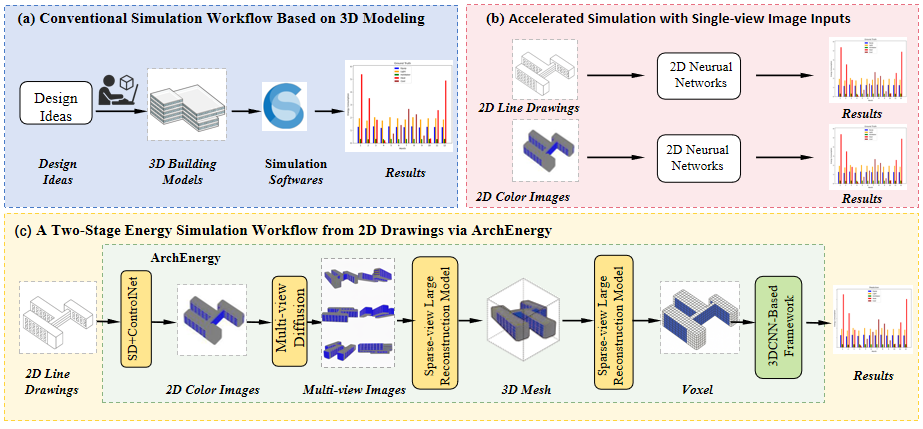
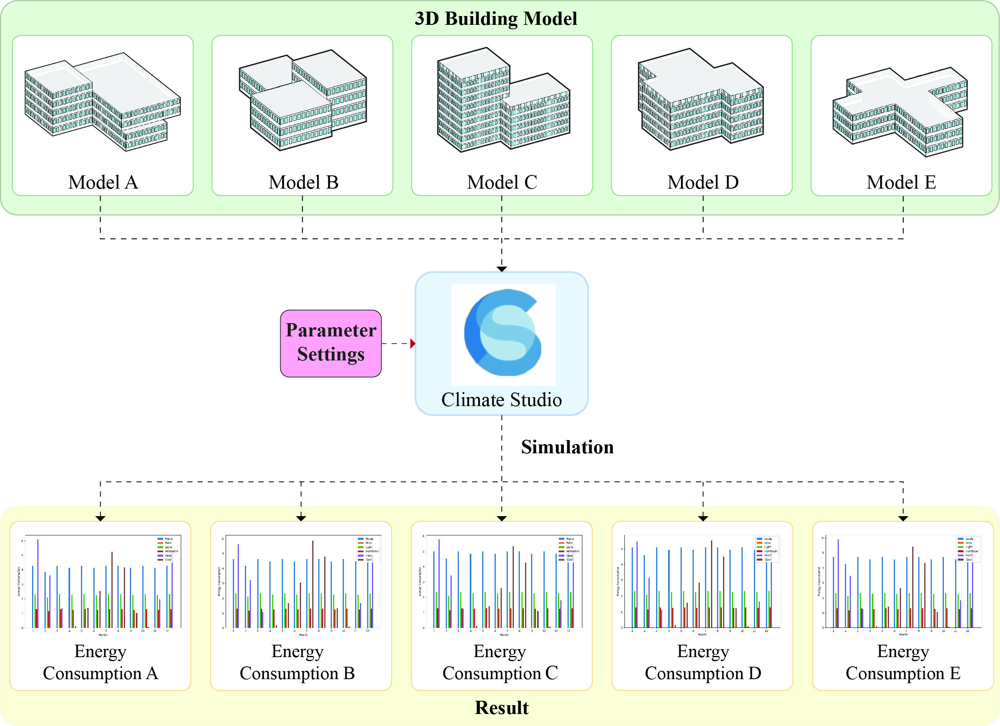
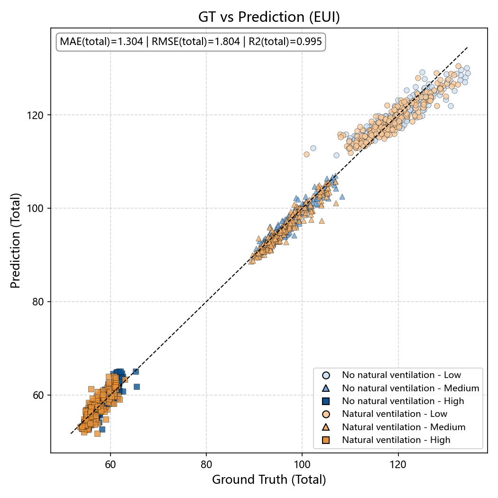

# ArchEnergy:AI-Empowered Prediction of Office Building Energy Use from Single-View Conceptual Images for Early-Stage Design

Abstract: *The building sector, particularly office buildings, accounts for a significant share of global energy consumption due to extended operational hours and intensive equipment use. While early-stage design decisions such as form, orientation and spatial layout exert a great influence on energy performance, existing energy prediction tools typically require complete 3D models, making them impractical for early design workflows that heavily rely on fast, iterative 2D conceptual images. This paper addresses the gap between early-stage architectural representation and energy performance feedback by asking: Can accurate energy consumption be predicted directly from a single 2D design image? To address this, we introduce ArchEnergy, a diffusion-based framework that estimates energy use directly from single-view images consisting of two stages: (1) a diffusion model combined with sparse-view reconstruction to generate a 3D mesh from a single conceptual image, and (2) a voxel-based 3D CNN incorporating masked autoencoding and contrastive learning for precise energy estimation. To support this framework, we construct ArchiMeshNet, a dataset of 6,784 architectural 3D models with EnergyPlus-simulated consumption data. Experimental results demonstrate that our ArchEnergy achieves high predictive accuracy (R² = 0.946, MAE = 0.443 kWh/m²·a), outperforming baseline models across both 3D reconstruction and energy prediction. ArchEnergy empowers architects to receive timely, geometry-informed energy feedback early in the design process, without the need for full 3D modelling, bridging a critical gap in existing workflows. By tightly coupling conceptual representation with performance prediction, this study lays the foundation for future research on intuitive, performance-driven design assistance and promotes sustainable architectural practice.*


[**Paper**]() | [**Project Page**]() | [**Model Weights**]() | [**Huggingface Demo**]() |


*Figure 1) Comparative Workflows for Building Energy Simulation: From Traditional 3D Modeling to the Proposed ArchEnergy Framework..*


*Figure 2) The Exportation Procedure of the ArchiMeshNet Dataset.*


*Figure 3)  Sample 3D building models from the ArchiMeshNet dataset, showcasing rich semantic variation and high geometric quality.*


*Figure 4) The Simulation Workflow Based on Climate Studio.*


*Figure 5) Single-view 3D Mesh Reconstruction Using a Diffusion-based framework.*


*Figure 6) Model Architecture for Building Energy Consumption Prediction.*


*Figure 7) Comparison of reconstruction methods on the ArchiMeshNet dataset. The first column shows the input image, and the remaining columns present results from baseline models..*


*Figure 8) Figure 8. Visualization of multi-view generation results. Each row shows an input image (leftmost) and four corresponding novel views synthesized by the proposed method. *


*Figure 9) Feature-wise Root Mean Squared Error (RMSE) for Energy Prediction.*


*Figure 10) Multi-category Energy Prediction vs. Ground Truth Scatter Plot. Unit: kWh/m2a*


*Figure 11) 3D mesh, scatter plot, and per-category monthly prediction curves for Case 1. Unit: kWh/m2a*


*Figure 12) 3D mesh, scatter plot, and per-category monthly prediction curves for Case 2. Unit: kWh/m2a.*


## TODO List

- [x] Release part of ArchiMeshNet dataset. 
- [ ] Release ArchEnergy inference code and pretrain weights.
- [ ] Upload ArchiMeshNet training dataset.
- [ ] Release ArchEnergy code.


## Train

```
python ArchEnergy_Train.py --dataset ArchiMeshNet --batch_size 32 --epoch 2000

```


## Train

```
python ArchEnergy_Sample.py --dataset ArchiMetricsNet --batch_size 32   --model_path ckpts/exp/model10000.pt --natural_ventilation True --envelope_performance high
```
